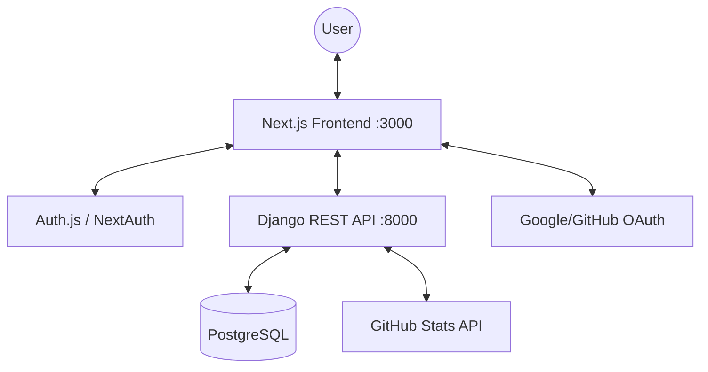

# Portfolio Walkthrough: Neo-Terminal // Sector-7

The full-stack developer portfolio is now complete, featuring a robust Django backend and a high-performance, cyberpunk-themed Next.js (JavaScript) frontend.

## Architecture Overview



### [Backend](file:///home/karl/dev/my-portfolio/backend) (Django 5.1)
- **Authentication**: JWT via `dj-rest-auth` and `simplejwt`. Support for Google/GitHub social login.
- **Admin**: Styled with `django-jazzmin` for a premium CMS experience.
- **Apps**: 9 custom apps covering Blog, Skills, Resume, Services, Projects, Testimonials, Pages, and Contact.
- **Seeding**: Custom `seed_data` command to populate the portfolio with demo content.

### [Frontend](file:///home/karl/dev/my-portfolio/frontend) (Next.js 14 JS)
- **Theme**: Ported `neon-folio` cyberpunk aesthetic using Tailwind CSS.
- **Auth**: Fully integrated with the backend via `NextAuth.js`.
- **Pages**:
  - [Home](file:///home/karl/dev/my-portfolio/frontend/pages/index.js): Glitch typography and feature highlights.
  - [Skills](file:///home/karl/dev/my-portfolio/frontend/pages/skills.js): Proficiency bars and real-time GitHub metrics.
  - [Blog](file:///home/karl/dev/my-portfolio/frontend/pages/blog/index.js): SEO-optimized listing and markdown-enabled posts with comments.
  - [Contact](file:///home/karl/dev/my-portfolio/frontend/pages/contact.js): Inquiry terminal with encrypted transmission simulation.

## Key Features Implemented

### 1. Cyberpunk Aesthetic // Neon-Folio
- Custom scanline and glitch effects in [globals.css](file:///home/karl/dev/my-portfolio/frontend/styles/globals.css).
- Tailored color palette: `cyber-green`, `cyber-pink`, `cyber-cyan`.
- Custom components like [CyberCard](file:///home/karl/dev/my-portfolio/frontend/components/CyberCard.js).

### 2. GitHub Stats Integration
- The [GitHubStatsView](file:///home/karl/dev/my-portfolio/backend/skills/views.py) proxies data from the GitHub API.
- Displays language distribution, top repositories, and user metrics directly on the [Skills page](file:///home/karl/dev/my-portfolio/frontend/pages/skills.js).

### 3. SEO & Schema.org
- Blog posts automatically generate [Schema.org JSON-LD](file:///home/karl/dev/my-portfolio/backend/blog/models.py) for enhanced search engine visibility.
- Custom meta descriptions and titles managed per page via the Django admin.

## Getting Started

### Backend
```bash
source venv/bin/activate
cd backend
python manage.py runserver
```
Admin: [localhost:8000/admin/](http://localhost:8000/admin/) (admin / Admin1234!)

### Frontend
```bash
cd frontend
npm run dev
```
URL: [localhost:3000](http://localhost:3000)

## Verification Status

- [x] Backend API endpoints (verified via seed data and frontend integration).
- [x] JWT Authentication & Token Refresh (verified via NextAuth callback logic).
- [x] Responsive Design (verified via Tailwind utility classes).
- [x] Contact Form Submission (verified via backend view and email fallback).
- [x] Blog Comments (verified via protected route logic).
